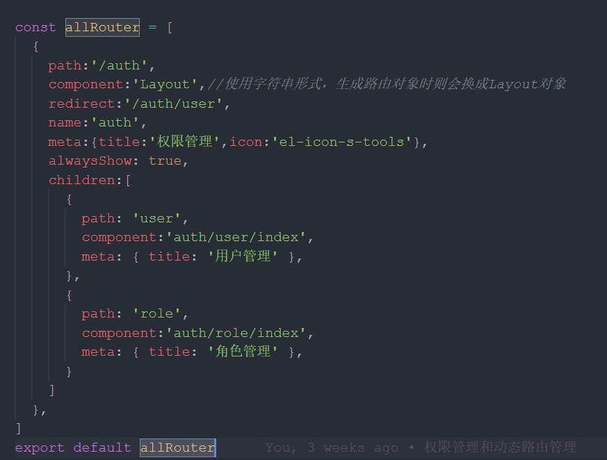
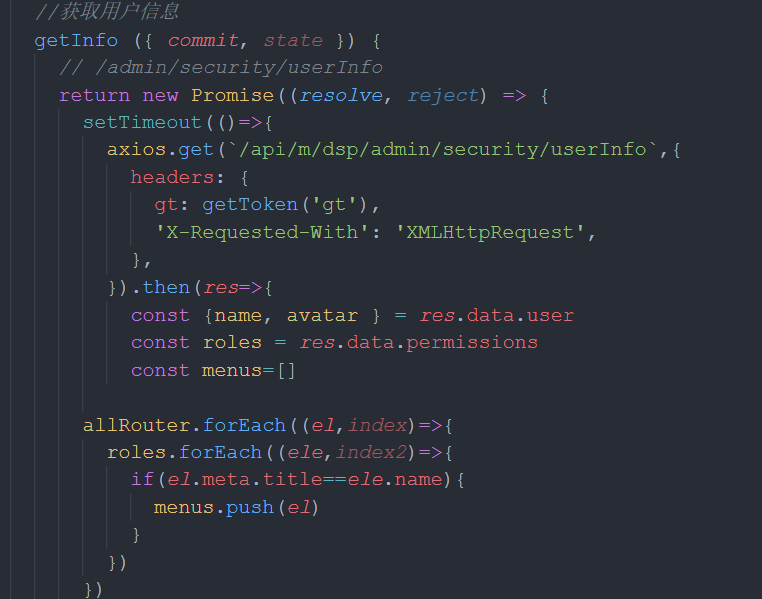
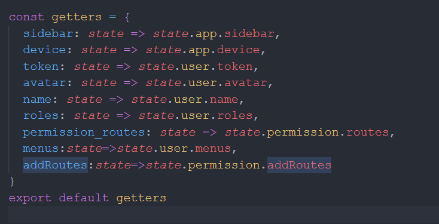

## 使用elementUI-admin如何实现动态路由效果

最近工作中使用了elementUI-admin的模板来快速搭建项目。同时要求实现动态路由效果。根据后台返回的数据，动态生成对应的路由。难点在于并没有固定的管理员角色。因此只能通过后台返回的数据来实现路由效果。

我的操作是，在本地写好所有的路由json文件，然后请求后台后，将文件数据和从后台获取的数据对比，提取相同的字段，然后再将字符串形式的路由变成路由对象，最后动态生成。

### 首先介绍要用到的几个文件

1、src/router/index.js ———— 路由文件。公用的路由写在这里，也可以在自定路由

2、src/store/index.js ————状态管理中，保存数据，在其他文件引用.在这里保持不动

3、src/store/getter.js ———— 状态管理中，从state中使用的数据，后需要用到

4、src/store/modules/user.js ———— 登录接口，在这里获取后台接口，获取路由数据并组装成对应的路由字符串

5、src/store/modules/permission.js ————将获取到的路由字符串变成路由对象

6、src/permission.js ———— 数据拦截并生成路由

### 具体操作

**1、src/router/index.js**
路由文件只保留公用的路由，其他的都可以删了


**2、新建路由json文件**
把所有的路由在本地写成json文件形式，按照正常的路由写法。


**3、获取后台返回的路由字段，保存在vuex中**
在src/store/modules/user.js中，有个getInfo()方法，这个方法就是查询用户信息，并返回用户的菜单列表

我是在这个文件中，引入自己在本地建立的json文件，将json文件数据和后台返回的数据进行对比组装，返回有相同字段的路由。
 
获取到相同字段路由的变量保存在vuex中


**4、将保存在vuex中的路由在getter中引用**


**5、变成路由对象**
我们现在拿到的路由其实是字符串形式，需要将字符串变为对象形式。
在src/store/modules/permission.js中，
```
import { asyncRoutes, constantRoutes } from '@/router'
import Layout from '@/layout'
/**
 * Use meta.role to determine if the current user has permission
 * @param roles
 * @param route
 */
function hasPermission (roles, route) {
  if (route.meta && route.meta.roles) {
    return roles.some(role => route.meta.roles.includes(role))
  } else {
    return true
  }
}

/**
 * Filter asynchronous routing tables by recursion
 * @param routes asyncRoutes
 * @param roles
 */
export function filterAsyncRoutes (routes, roles) {
  const res = []

  routes.forEach(route => {
    const tmp = { ...route }
    if (hasPermission(roles, tmp)) {
      if (tmp.children) {
        tmp.children = filterAsyncRoutes(tmp.children, roles)
      }
      res.push(tmp)
    }
  })

  return res
}

const state = {
  routes: [],
  addRoutes: [],
}

const mutations = {
  SET_ROUTES: (state, routes) => {
    state.addRoutes = routes//保存在vuex中
    state.routes = constantRoutes.concat(routes)
  },
}

const actions = {
  generateRoutes ({ commit,state }, {roles,menusss}) {
    return new Promise(resolve => {
      let accessedRoutes
      accessedRoutes = dataArrayToRoutes(menusss)//变成路由对象形式
      commit('SET_ROUTES', accessedRoutes)//保存在setter中
      resolve()
    })
  },
}
function dataArrayToRoutes(data) {
  const res = []
  data.forEach(item => {
    const tmp = { ...item }
    if (tmp.component === 'Layout') {
      tmp.component = Layout
    } else {
      let sub_view = tmp.component
      sub_view = sub_view.replace(/^\/*/g, '')
      
      tmp.component = (resolve)=>require([`@/views/${sub_view}`] ,resolve)//只能用require的方式将路由引入；使用拼接的方式也不行。views后面没有斜杠也不行。
    }
    if (tmp.children) {
      tmp.children = dataArrayToRoutes(tmp.children)
    }
    res.push(tmp)
  })
  return res
}
export default {
  namespaced: true,
  state,
  mutations,
  actions,
}
```
在这个文件中，有一点要非常注意，就是在将路由字符串变为对象的那个函数中，引入路由时，必须使用require方式，之前使用过import方式并不行。

**6、生成动态路由**
```
import router from './router'
import store from './store'
import { Message } from 'element-ui'
import NProgress from 'nprogress' // progress bar
import 'nprogress/nprogress.css' // progress bar style
import { getToken } from '@/utils/auth' // get token from cookie
import getPageTitle from '@/utils/get-page-title'
import Layout from '@/layout'
NProgress.configure({ showSpinner: false }) // NProgress Configuration

const whiteList = ['/login'] // no redirect whitelist

router.beforeEach(async (to, from, next) => {
  // start progress bar
  NProgress.start()

  // set page title
  document.title = getPageTitle(to.meta.title)

  // determine whether the user has logged in
  const hasToken = getToken()

  if (hasToken) {
    if (to.path === '/login') {
      // if is logged in, redirect to the home page
      next({ path: '/' })
      NProgress.done()
    } else {
      const hasRoles = store.getters.name
      if (hasRoles) {
        next()
      } else {
        if(store.getters.menus.length==0){
          await store.dispatch('user/getInfo')
          const menusss = store.getters.menus//获取到路由字符串
          store.dispatch('permission/generateRoutes', { menusss }).then(()=>{//通过请求获取路由对象
            store.getters.addRoutes.push(
              {
                path: '/404',
                component: () => import('@/views/404'),
                hidden: true,
              },
            )
            store.getters.addRoutes.forEach(element=>{router.options.routes.push(element)})//去重
            router.addRoutes(store.getters.addRoutes)//保存在router路由中
            next({ ...to, replace: true })
          }).catch(()=>{
            next(`/login?redirect=${to.path}`)
            NProgress.done()
          })
        }else{
          next()
        }
      }
    }
  } else {
    if (whiteList.indexOf(to.path) !== -1) {
      // in the free login whitelist, go directly
      next()
    } else {
      // other pages that do not have permission to access are redirected to the login page.
      next(`/login?redirect=${to.path}`)
      NProgress.done()
    }
  }
})

router.afterEach(() => {
  // finish progress bar
  NProgress.done()
})
```
### 最后一步
修改src/layout/Sidebar/index.vue文件，将侧边栏的路由数组改成在src/store/modules/permission.js保存的路由对象


