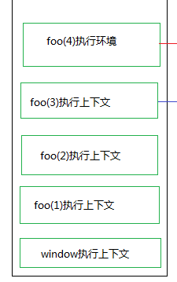

### 理解JS中的执行环境和作用域

### 执行环境

JS中的执行环境，是指定义的变量或函数有权访问其他数据的环境，在每个执行环境中有与之相关的变量对象，在这个执行环境中，对变量或调用函数按照代码执行规则来执行。

window是最大最外围的执行环境。

作用域：

作用域说的是**变量**，而且只是针对**函数作用域**和**全局作用域**。也就是说for循环，if判断等是没有作用域的，在其内部定义的变量会被提升到其上面。有函数会被置于函数声明之下。每个函数都有自己的作用域。

作用域链

我自己的理解就是：每个执行环境对应着变量对象，变量对象包含着变量和函数，当代码执行的时候，变量对象会遵循由下到上，有内到外的去搜索对应的变量，直至到window这一层执行环境

特点：

1、函数内部的环境可以通过作用域链访问所有的外部环境，但外部环境无法访问内部环境中的任何变量和函数。

2、每个环境都可以向上搜索作用域链，以查询变量和函数名，但任何环境都不能通过向下搜索作用域而进入另一个执行环境。


### 案例

```
var scope="global";
var fn
console.log(fn)//undefined
function foo(){
    fn='inside'
    console.log(scope);//global
}    
foo();
```

在这个例子中，函数foo()的作用域链包含了两个对象，一个是它自身对象，一个是全局环境中的变量对象。在函数内部我们可以访问全局作用域的scope，但是在函数外部是不能访问到函数内部定义的变量的fn的值。

### 执行环境中的执行顺序

```
var i= 1
function foo(i){
    if(i == 4){
        return
    }
    foo(i+1)
    console.log(i);//3,2,1
}
foo(1)
```
在这个例子中，我们知道是输出1,2,3，但为什么输出的顺序上是3,2,1呢？

先来看看到底上面的代码的执行顺序：

定义了全局变量i，是window上的执行环境，然后每次执行foo()时，就会创建一个执行环境，执行函数后，i等于3的时候退出。

结果上依次输出3,2,1的问题，是因为执行环境中涉及到堆栈。每次函数执行都会创建一个执行环境，每次调用函数都会把这个执行函数推到栈中，只有当这个函数全部执行完毕后这个环境才释放出来最终的结果。而且栈的特点是后进先出。所以依次输出3,2,1



### es6中提供了块级作用域

在es5，我们使用var关键字来声明变量，会有变量声明提前。在es6中，可以通过let或const来声明变量，通过这两个关键字声明的变量是有块级作用域的，也就是它不会进行变量声明提升。

```
console.log(color)//undefined
if(true){
    var color='blue'
}
console.log(color)//blue
```

上面的例子中，在if里面声明变量color，其实可以提升到if外面声明，在if里面再赋值。所以在外面能访问到color这个变量，一个是undefined，另一个是blue。

```
console.log(color)//color is not defined
if(true){
    let color='blue'
}
console.log(color)//color is not defined
```

但是如果把var换成let或const后，在if外面就不能访问到变量color了，这是因为使用let或const定义的变量都有自己的块级作用域，在其外部是不能访问到的。


