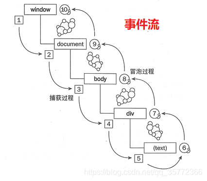

## JS事件机制

### JS事件绑定的三种方式

```
// 第一种：HTML内联属性
<div onclick="fun();">click</div>
// 第二种，DOM属性绑定
document.getElementById("xxx").onclick = function(){
			
};
// 第三种：事件监听函数
element.addEventListener(<event-name>, <callback>, <use-capture>);
```

第一种和第二种同时使用时，第二种方法会覆盖第一种方法，两者属于同一方式，只是写法不同。但是addEventListener不会，这个方法会绑定多个事件程序，依次执行。

### 事件触发流程



js的事件传递流程有两个阶段:第一个是事件捕获阶段，第二个是事件冒泡阶段

事件捕获阶段是从上到下传递事件，事件冒泡阶段是从下到上传递事件。

addEventListener第三个参数传入true就可鉴别到事件捕获阶段。默认第三个参数是false，也就是事件冒泡方式，true表示事件捕获方式。

### 什么是事件冒泡？

事件冒泡指事件首先在最内部的目标元素上触发，然后在同一嵌套层次结构中依次在目标元素的祖先（父代）上触发，直到到达最外层的 DOM 元素。

比如下面的事件：

```
<div id='parent'>
	  <p id='child'>事件冒泡</p>
	  <p>事件1</p>
	  <p>事件2</p>
	  <p>事件3</p>
	  <p>事件4</p>
	  <p>事件5</p>
  </div>

  <script>
    window.onload=function(){
		
		var oParent = document.getElementById('parent')
		
		var oChild = document.getElementById('child')
		
		oChild.onclick=function(){
			console.log('点击子元素事件')
		}
		
		oParent.onclick = function(){
			console.log('冒泡到父级')
		}
	}
  </script>
```
当我们点击第一个p标签时，会依次打印出'点击子元素事件'和'冒泡到父级'，但是其他p标签并没有挂载事件，点击其他p标签依然能父级的事件，打印出'冒泡到父级'.这就是事件冒泡，子元素事件可以触发父级的事件。

### 什么是事件捕获？

事件捕获指的是事件首先被最外面的元素捕获，然后在同一嵌套层次结构中依次触发目标元素的后代（子元素），直到到达最里面的 DOM 元素。

```
<div id='parent'>
	  <p id='child'>事件冒泡</p>
	  <p>事件1</p>
	  <p>事件2</p>
	  <p>事件3</p>
	  <p>事件4</p>
	  <p>事件5</p>
  </div>

  <script>
    window.onload=function(){
		
		var oParent = document.getElementById('parent')

		oParent.onclick = function(e){
			console.log(e.target)
			console.log(e.target.innerHTML)//获取到子元素的值
		}
	}
  </script>
  <style type="text/css">
  	#parent{
		border: 1px solid #ccc;
		padding: 20px;
	}
	p{
		border: 1px solid #ccc;
	}
  </style>
```
还是刚才的例子，当我们只给父级添加事件时，是可以通过事件捕获来获取子元素的innerHTML。由父级事件触发子级。

采用事件捕获方式，可以将本要添加在自身的事件，添加到别人身上。将事件添加到父级，触发执行效果。比如我们需要获取每一个li的值，如果给每一个li设置事件，就非常麻烦。通过捕获的方式，可以只给父级设置事件即可。

### addEventListener事件

DOM 事件标准描述了事件传播的 3 个阶段：

捕获阶段（capture phase）：事件从 Window 对象向下传递到目标节点。

目标阶段（target phase）：事件到达目标元素。

冒泡阶段（bubbling phase）：事件从元素上开始冒泡。

事件对象中有一个参数叫eventPhase，是一个数字，表示这个事件在哪个阶段触发。

在事件捕获中，事件是先捕获，再冒泡。 

因为浏览器默认是从事件冒泡开始，我们看不到事件捕获，所以想要测试事件捕获我们需要使用到 addEventListener 方法，
addEventListener 用于添加事件句柄、注册监听器，参数三还可以指定在捕获阶段还是冒泡阶段触发事件。

```
<ul id='list'>
  	<li id='list_item'>
		<span id='list_span'>点击</span>
	</li>
  </ul>

  <script>
    window.onload=function(){
		
		var oUl = document.getElementById('list')
		var oLi = document.getElementById('list_item')
		var oSpan = document.getElementById('list_span')
		
		oUl.addEventListener('click',(e)=>{
			console.log('ul元素')
		})
		
		oLi.addEventListener('click',(e)=>{
			console.log('li元素')
		})
		
		oSpan.addEventListener('click',(e)=>{
			console.log('span元素')
		})
	}
  </script>
  <style type="text/css">
  	#list{
		border: 1px solid #ccc;
		padding: 20px;
	}
	#list_item{
		border: 1px solid #ED6A0C;
		padding: 20px;
	}
  </style>
```
点击ul时，只会打印出'ul元素',而不会向下执行。但是点击span的时候，会执行事件冒泡打印出上面所有的信息。

addEventListener默认是false,也就是事件冒泡方式，如果父元素和子元素都是事件冒泡，那执行顺序就是从上到下执行。如果事件冒泡和事件捕获同时存在呢？

浏览器会先执行事件捕获，再按照事件冒泡顺序执行。还是上面的例子：

```
window.onload=function(){
		
		var oUl = document.getElementById('list')
		var oLi = document.getElementById('list_item')
		var oSpan = document.getElementById('list_span')
		
		oUl.addEventListener('click',(e)=>{
			console.log('ul元素')
		})
		
		oLi.addEventListener('click',(e)=>{
			console.log('li元素')
		},true)
		
		oSpan.addEventListener('click',(e)=>{
			console.log('span元素')
		})
	}
```

如果给li的addEventListener事件的第三个属性设置为true，点击span依次打印：li元素、ul元素、span元素

**如何使用**

1、使用函数名，引用外部函数

```
element.addEventListener("click", myFunction);

function myFunction() {
    alert ("Hello World!");
}
```

2、向window对象添加句柄

```
window.addEventListener("resize", function(){
    document.getElementById("demo").innerHTML = sometext;
});
```

3、传递参数

当传递参数值时，使用“匿名函数”调用带参数的函数：

```
var p1 = 5;
var p2 = 7;
document.getElementById("myBtn").addEventListener("click", function() {
    myFunction(p1, p2);
});
function myFunction(a, b) {
    var result = a * b;
    document.getElementById("demo").innerHTML = result;
}
```

如何移除监听事件呢?

```
element.removeEventListener("mousemove", myFunction);
```


### addEventListener和onclick的区别

区别：

1、对于同一个元素而言，addEventListener它允许给一个事件注册多个监听器，事件可以先后运行，不会被覆盖；onclick事件有多个会被覆盖

2、addEventListener可以选择捕获或者冒泡

3、addEventListener对任何DOM元素都有效，并不仅仅对html元素有效

### 阻止事件传播

使用 event.stopPropagation() 方法用于阻止捕获和冒泡阶段中当前事件在 DOM 中的进一步传播。

```
window.onload=function(){
		
		var oUl = document.getElementById('list')
		var oLi = document.getElementById('list_item')
		var oSpan = document.getElementById('list_span')
		
		oUl.addEventListener('click',(e)=>{
			console.log('ul元素')
		})
		
		oLi.addEventListener('click',(e)=>{
			console.log('li元素')
		})
		
		oSpan.addEventListener('click',(e)=>{
			console.log('span元素')
			e.stopPropagation()
		})
	}
```
还是上面的例子，如果我们给span元素设置e.stopPropagation()，那么就只会打印'span元素'，而不会向上冒泡执行。但是如果我们将上面的ul或li的第三个参数设置为true,也就是捕获方式，就会打印出来。也证明了浏览器事件执行是先捕获再冒泡

### 阻止默认事件
```
event.preventDefault();  event.returnValue = false;  return false;
```

使用 event.preventDefault() 方法取消浏览器对当前事件的默认行为，使用场景：

1、Submit按钮的提交

2、a标签链接跳转

3、上下文菜单中使用，它将阻止其显示或隐藏

4、阻止鼠标右键事件

```
document.oncontextmenu = function(e){
    e.preventDefault();//阻止鼠标右键事件
};
```

### retrun false 用法涉及哪些步骤

事件处理程序中的 return false 语句执行以下步骤：

1、它停止了浏览器的默认操作或行为。

2、它防止事件传播 DOM

3、停止回调执行，并在调用时立即返回。

比如在阻止鼠标右键事件中，也可以使用retrun false来阻止

```
document.oncontextmenu = function(e){
    return false //阻止鼠标右键事件
};
```


