## HTML知识图谱
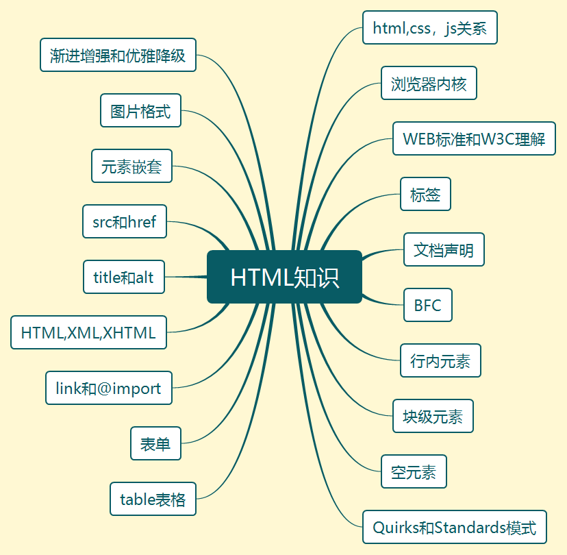

### 浏览器页面构成
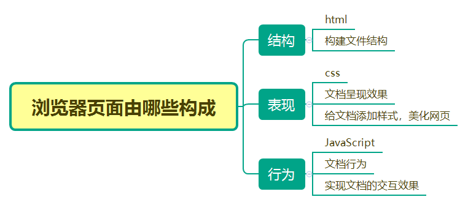
### web标准和W3C
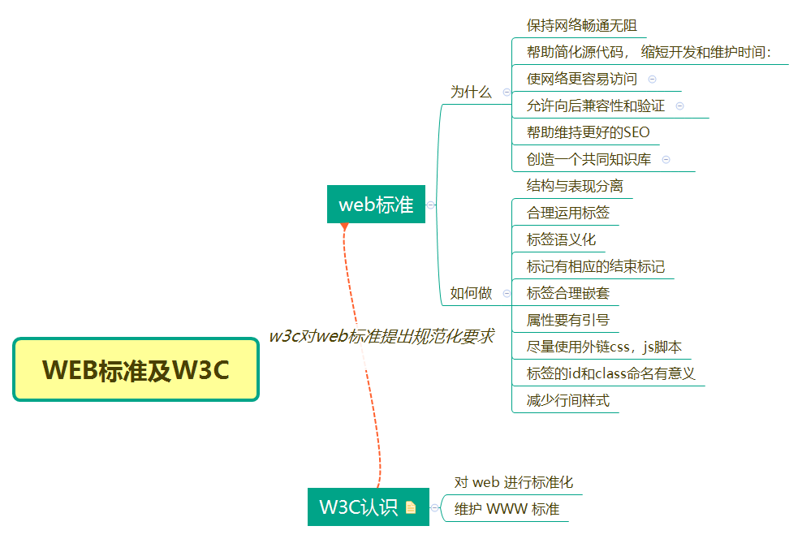
### 浏览器内核
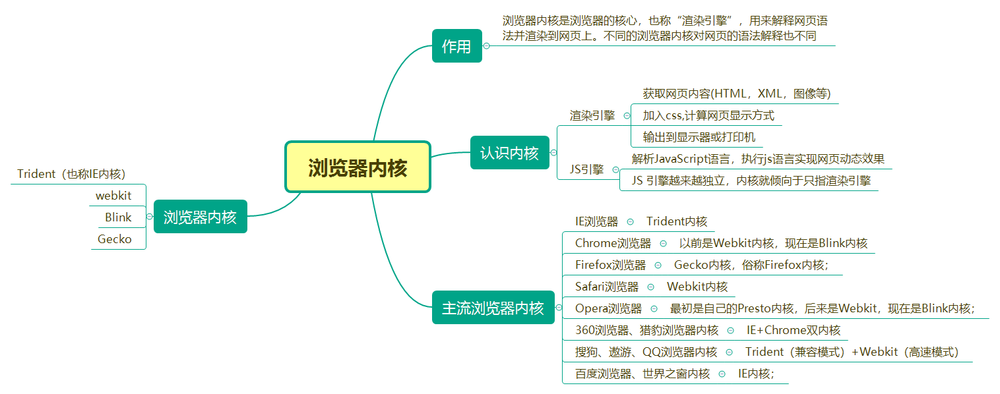
### 文档声明
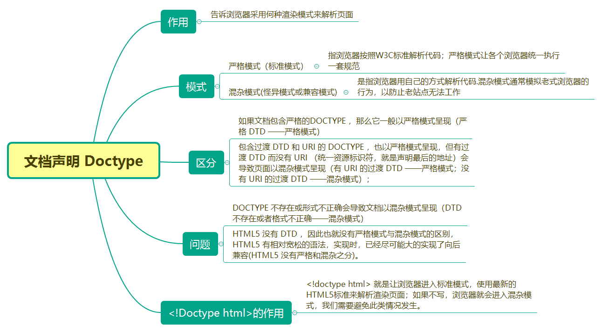
### meta标签
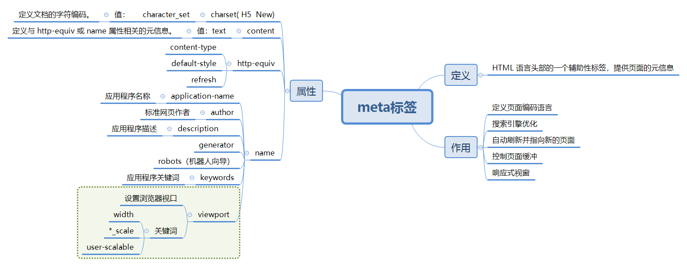
### meta标签的name属性
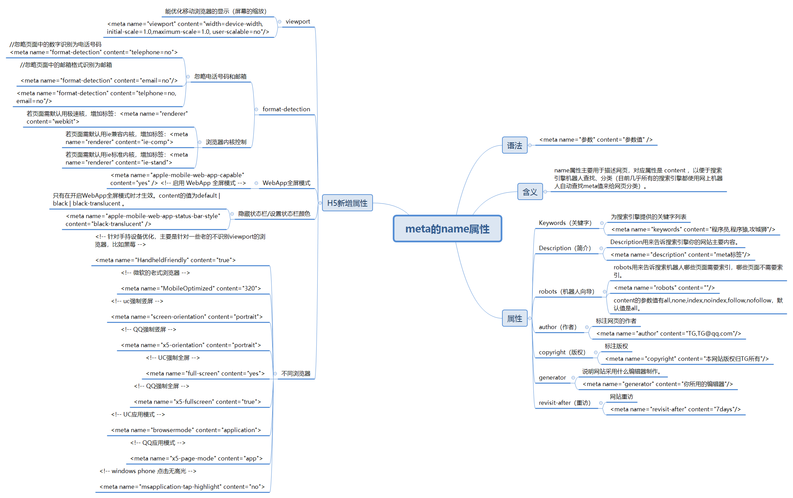
### meta标签的http-equiv属性
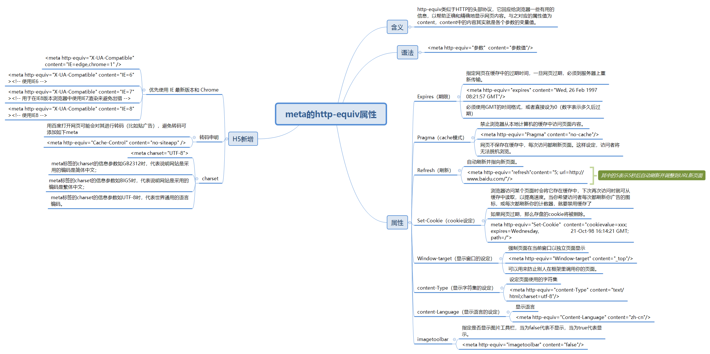
### link和@import
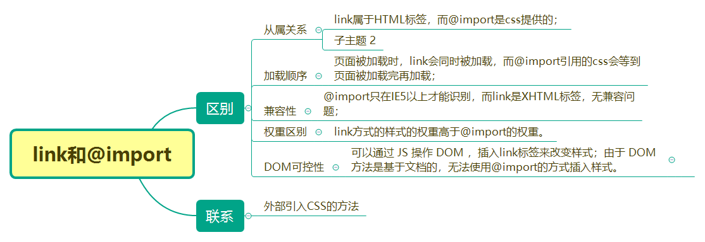
### 图片的title属性和alt属性
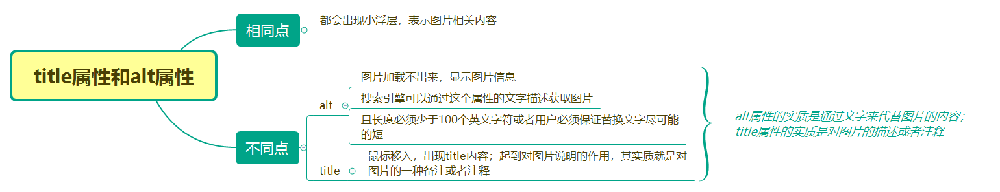
### 行内标签和块级标签
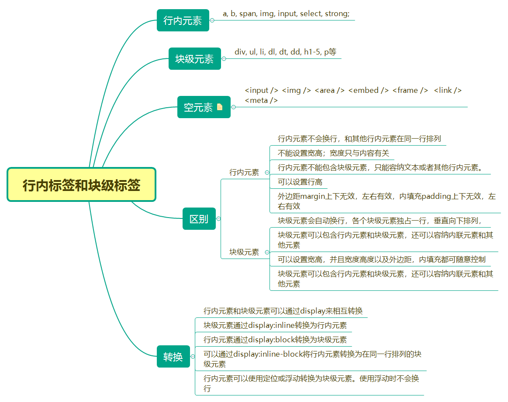
### BFC
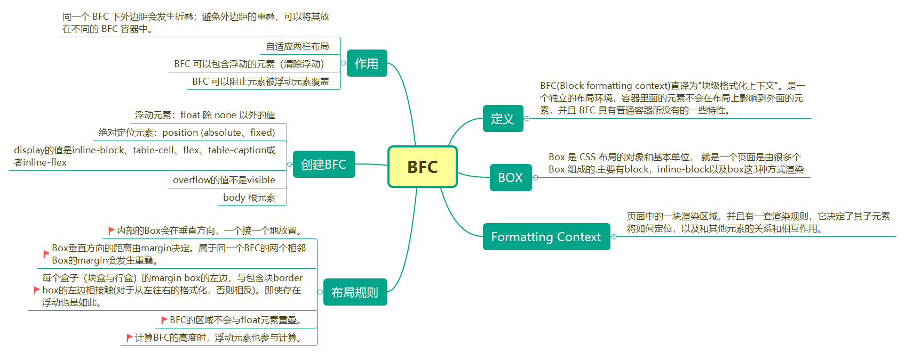
### a标签
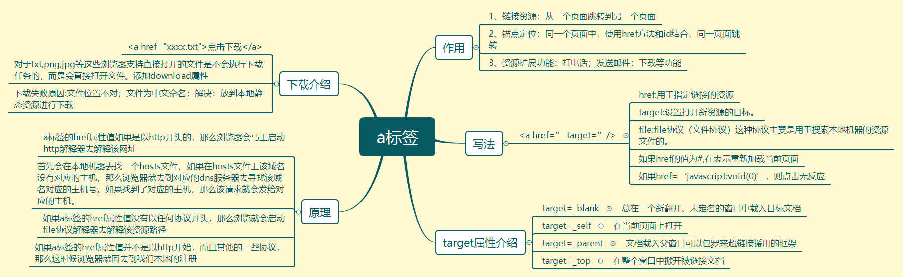
### img标签
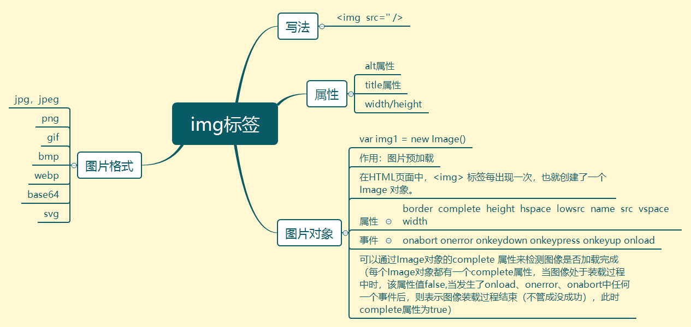
